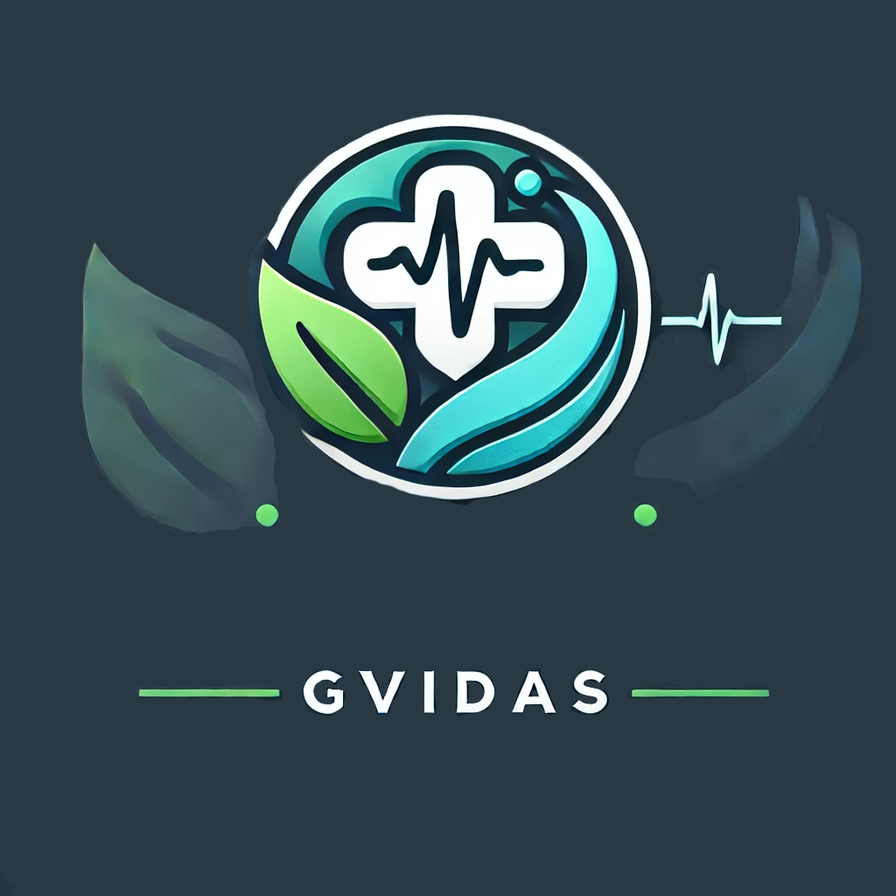

# 🏥 Clínica GVidas - Sistema de Agendamento

Sistema de agendamento de consultas e exames para a **Clínica GVidas**, permitindo que pacientes escolham especialidades, médicos e horários disponíveis.

---

## 📌 **Sobre o Projeto**
Este projeto tem como objetivo facilitar o agendamento de consultas e exames médicos por meio de um formulário interativo. O sistema permite que os usuários escolham:

✔️ **Especialidade Médica**  
✔️ **Médicos disponíveis por especialidade**  
✔️ **Exames disponíveis**  
✔️ **Horário da consulta**  
✔️ **Forma de pagamento**  
✔️ **Confirmação de agendamento**

## 🚀 **Funcionalidades**
- 📅 **Escolha de especialidade médica**: Apenas médicos da especialidade selecionada são exibidos.
- ⏰ **Seleção de horários disponíveis**.
- 🏥 **Opção de exames complementares**.
- 💳 **Múltiplas formas de pagamento**.
- ✅ **Confirmação do agendamento antes do envio**.

---

## 🛠️ **Tecnologias Utilizadas**
- **HTML5** → Estrutura do site  
- **CSS3** → Estilização e layout  
- **JavaScript (Vanilla JS)** → Interatividade e validação  
